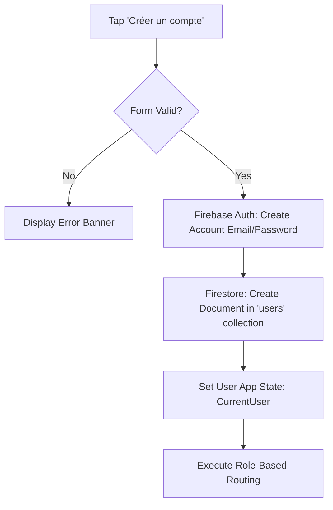
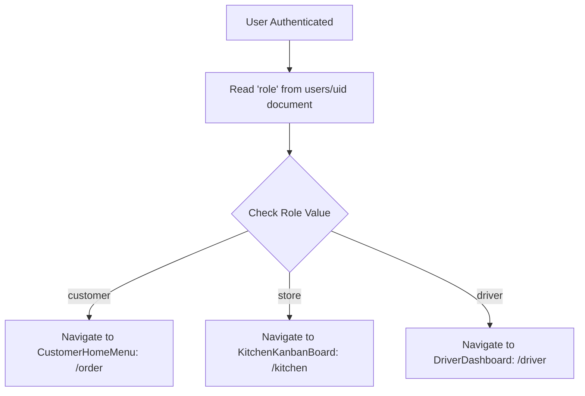

# Authentication, Firestore Schema & Role-Based Routing Architecture

**La Maison des Wraps** (Drummondville, QC)  
Project ID: `maison-wraps-7fbdj4`

---

## 1. Sign-Up Page & Form Validation Specification

### Visual Design Tokens (High-Contrast Restaurant Console)
- **Background Color**: `#121212` (Deep Charcoal)
- **Card / Surface**: `#222222` (Slate Surface)
- **Primary CTA / Buttons**: `#FF5500` (Flame Orange)
- **Primary Text**: `#FFFFFF` (High-Contrast White)
- **Secondary / Subtitles**: `#A0A0A5`
- **Border Stroke**: `#32323A` (1px Solid)

### Form Fields & Controller Keys
| Field Label (FR / EN) | Widget Identifier | Type | Validation Rules |
| :--- | :--- | :--- | :--- |
| **Nom complet / Full Name** | `textField_Name` | `String` | Required (`!name.isEmpty`) |
| **Courriel / Email Address** | `textField_Email` | `Email` | Valid RFC 5322 regex (`^[^\s@]+@[^\s@]+\.[^\s@]+$`) |
| **Numéro de téléphone / Phone** | `textField_Phone` | `Phone` | Required (`!phone.isEmpty`) |
| **Mot de passe / Password** | `textField_Password` | `Password` | Minimum 6 characters (`password.length >= 6`) |
| **Confirmer mot de passe / Confirm Password** | `textField_ConfirmPassword` | `Password` | Must strictly match `textField_Password` |

---

## 2. User Creation & Firestore Schema Action Flow

When the user taps **"Créer un compte / Create Account"**:



### Firestore Schema: `/users/{uid}`
```json
{
  "uid": "AUTHENTICATED_USER_ID",
  "name": "Jean Tremblay",
  "email": "jean.tremblay@exemple.com",
  "phone": "819 850-3972",
  "role": "customer",
  "preferred_language": "fr",
  "created_at": "2026-08-17T22:30:00.000Z"
}
```

- **`role`**: `'customer'` (Default for all public app registrations), `'store'` (Kitchen staff), `'driver'` (Delivery personnel).
- **`preferred_language`**: `'fr'` (French default) / `'en'` (English toggle).

---

## 3. Login Flow & Conditional Role-Based Routing

On successful Login (or immediate post-registration redirect):



### Routing Table
| Authenticated User Role | Destination Page in FlutterFlow | Route Path | Access Permissions |
| :--- | :--- | :--- | :--- |
| **`customer`** | `CustomerHomeMenu` (`Scaffold_scaffold1_0`) | `/order` | Place orders, track deliveries, view history |
| **`store`** | `KitchenKanbanBoard` (`Scaffold_scaffold6_466`) | `/kitchen` | View Kanban tickets, audio alerts, 86 inventory |
| **`driver`** | `DriverDashboard` (`Scaffold_scaffold8_685`) | `/driver` | Camera QR pickup scanner, live GPS, doorstep drop-off |

---

## 4. Bilingual Localization Dictionary (FR / EN)

| Key | French (Default) | English |
| :--- | :--- | :--- |
| `name_label` | Nom complet | Full Name |
| `email_label` | Courriel | Email Address |
| `phone_label` | Numéro de téléphone | Phone Number |
| `password_label` | Mot de passe | Password |
| `confirm_password_label` | Confirmer le mot de passe | Confirm Password |
| `signup_button` | Créer un compte | Create Account |
| `signin_button` | Se connecter | Sign In |
| `have_account` | Vous avez déjà un compte? | Already have an account? |
| `no_account` | Pas encore de compte? | Don't have an account? |
| `pass_mismatch_error` | Les mots de passe ne correspondent pas. | Passwords do not match. |
| `pass_length_error` | Le mot de passe doit comporter au moins 6 caractères. | Password must be at least 6 characters. |
| `email_invalid_error` | Veuillez entrer une adresse courriel valide. | Please enter a valid email address. |
